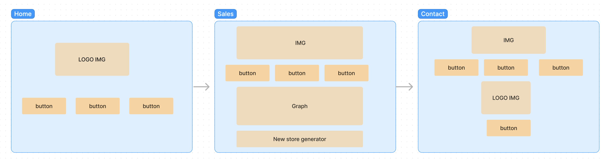

# cookies-stand
## Collaboration:  
Reed Vogt, Coriana Williams
## Problem Domain 
The problem domain for the Salmon Cookies application in the context of the Vue.js framework involves developing a web application that allows Pat's Salmon Cookies business to calculate the number of cookies each location needs to make every day. This calculation is based on factors such as the hours of operation, minimum and maximum number of customers per hour, and the average number of cookies purchased per customer.

The main objective is to provide a tool that helps manage supplies inventory and baking schedules for each location. The application should be adaptable, allowing Pat to easily add or remove locations from the daily projections report and modify input numbers based on different factors like the day of the week or special events.

In addition to the functionality, the problem domain also includes the design and branding aspects of the public-facing page. This involves creating a visually appealing website with a color scheme, fonts, and additional images that align with the Salmon Cookies brand. The goal is to present the necessary information in a clear and user-friendly manner to attract and engage potential customers.

Overall, the problem domain for the Salmon Cookies application in the Vue.js framework encompasses both the technical implementation of the calculations and data management, as well as the design and presentation of the public-facing website to support the business's branding and marketing efforts.

## Links and Resources
- 
- 
- 
### Project Setup
npm install
npm run dev
### Run Unit Tests
npm run test:unit

### PROJECT FILE STRUCTURE
.
├── index.html
├── LICENSE
├── .eslintrc.cjs
├── vite.config.js
├── vitest.config.js
├── README.md
├── public
│   └── favicon.ico
├── .prettierrc.json
├── .gitignore
├── package-lock.json
├── package.json
├── .github
│   └── workflow
│       └── node.yml
├── .git
│   ├── config
│   ├── objects
│   │   ├── pack
│   │   │   ├── pack-5120aaa52d15a0d5505af21d38dc79d4d55a1ac4.idx
│   │   │   └── pack-5120aaa52d15a0d5505af21d38dc79d4d55a1ac4.pack
│   │   └── info
│   ├── HEAD
│   ├── info
│   │   └── exclude
│   ├── logs
│   │   ├── HEAD
│   │   └── refs
│   │       ├── heads
│   │       │   ├── reedBranch
│   │       │   └── main
│   │       └── remotes
│   │           └── origin
│   │               └── HEAD
│   ├── description
│   ├── hooks
│   │   ├── commit-msg.sample
│   │   ├── pre-rebase.sample
│   │   ├── pre-commit.sample
│   │   ├── applypatch-msg.sample
│   │   ├── fsmonitor-watchman.sample
│   │   ├── pre-receive.sample
│   │   ├── prepare-commit-msg.sample
│   │   ├── post-update.sample
│   │   ├── pre-merge-commit.sample
│   │   ├── pre-applypatch.sample
│   │   ├── pre-push.sample
│   │   ├── update.sample
│   │   └── push-to-checkout.sample
│   ├── refs
│   │   ├── heads
│   │   │   ├── reedBranch
│   │   │   └── main
│   │   ├── tags
│   │   └── remotes
│   │       └── origin
│   │           └── HEAD
│   ├── index
│   └── packed-refs
├── .vscode
│   └── extensions.json
└── src
    ├── App.vue
    ├── stores
    │   └── counter.js
    ├── main.js
    ├── components
    │   ├── HelloWorld.vue
    │   ├── __tests__
    │   │   └── HelloWorld.spec.js
    │   ├── icons
    │   │   ├── IconCommunity.vue
    │   │   ├── IconSupport.vue
    │   │   ├── IconTooling.vue
    │   │   ├── IconDocumentation.vue
    │   │   └── IconEcosystem.vue
    │   ├── WelcomeItem.vue
    │   └── TheWelcome.vue
    ├── views
    │   ├── AboutView.vue
    │   └── HomeView.vue
    ├── assets
    │   ├── app.css
    │   ├── main.css
    │   ├── img
    │   │   ├── fish.jpeg
    │   │   ├── salmon.png
    │   │   ├── shirt.jpeg
    │   │   ├── frosted-cookie.jpeg
    │   │   ├── chinook.jpeg
    │   │   ├── family.jpeg
    │   │   ├── fish.jpg
    │   │   └── cutter.jpeg
    │   ├── logo.svg
    │   └── base.css
    └── router
        └── index.js

